# Tentando aprender programação e enlouquecendo no processo :)

- 🔭 Atualmente sem grandes projetos focando no aprendizado e que caminho seguir no ramo
- 🌱 Estou aprendendo sobre sistemas gerais, basicamente tudo que é base da programação
- 📫 Tenho algumas redes, não sou muito ativo, tenho canais no youtube mais por hobbie 
- ⚡ Curto jogos em geral, series mas ainda assim de forma meio nichada

  
  <h3>Conhecimentos:</h3>
  <h4>🗨️Linguagens de programação:</h4>
  

    
    
  

   
  <h4>🔆Linguagens de marcação:</h4>
  

    
    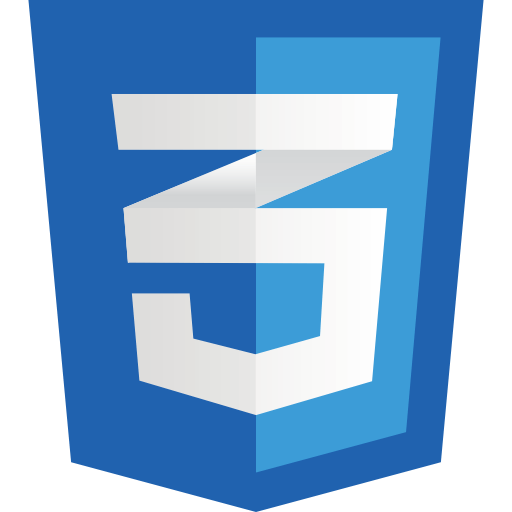
  

  
  <h4>🧩Frameworks:</h4>
  

    
  

  
  <h4>🗄️Banco de Dados:</h4>
  

    
  

 
  
  <h1>🦐Além de programação🦐</h1>
  
  
Meu canal do yotube :)

    
  

  <h2>jogos de interesse🎮</h2>

  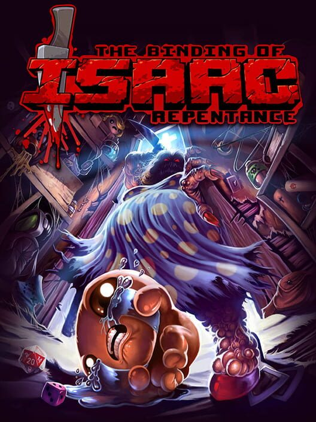
  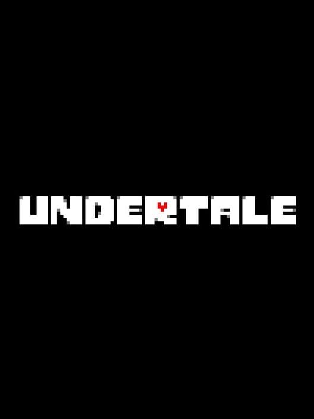
  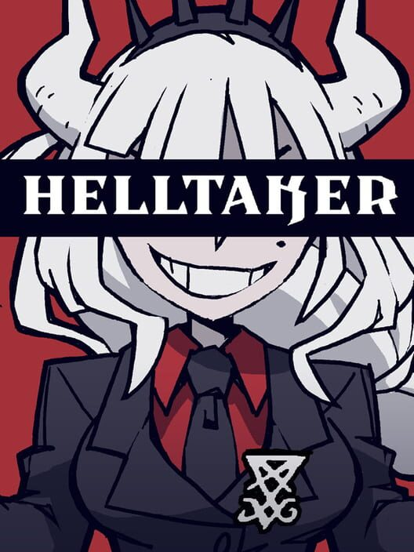
  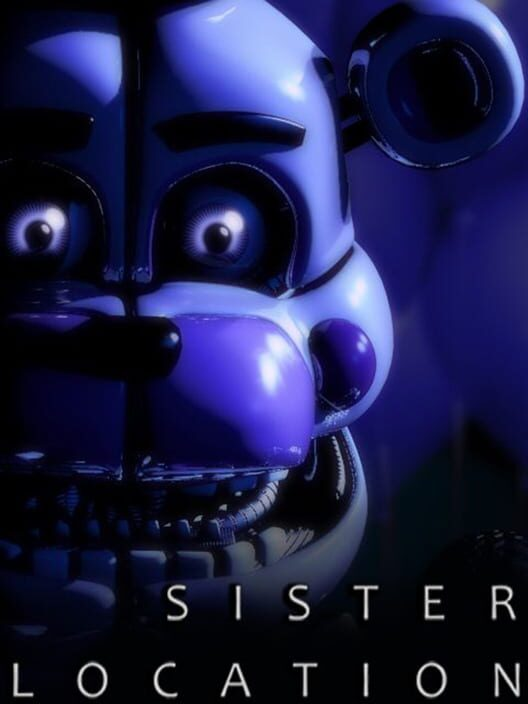
  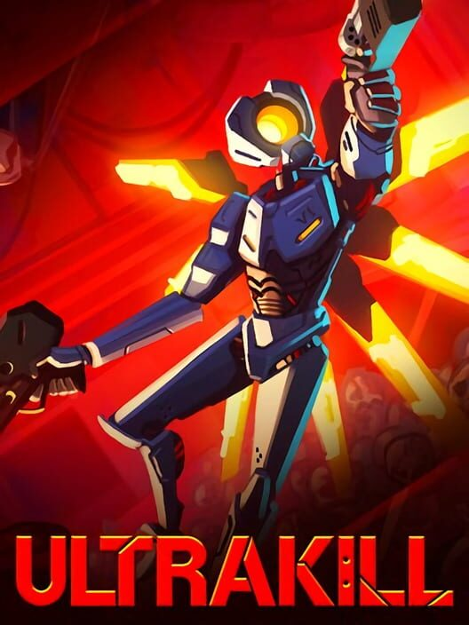

  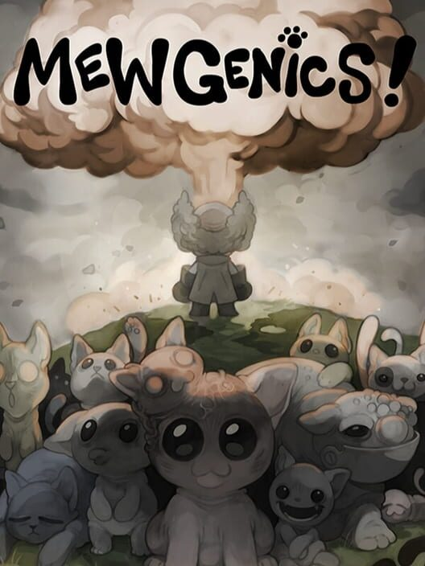
  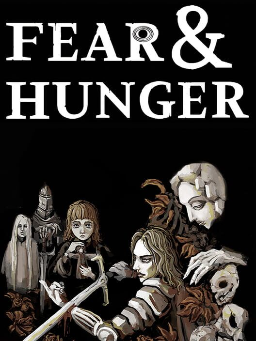
  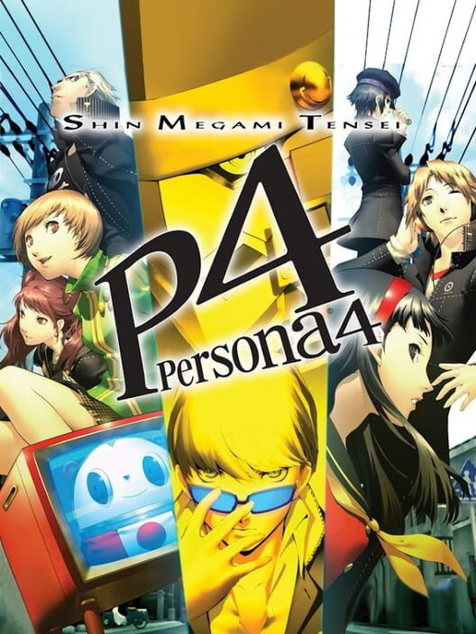
  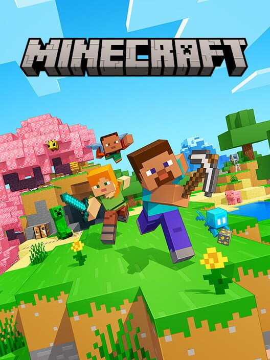
  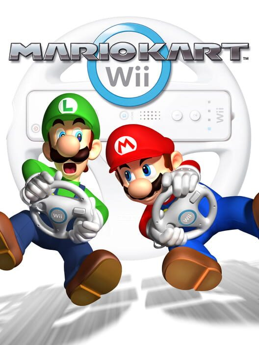

   <h2>Entretenimentos de Interesse🎬</h2>
  

    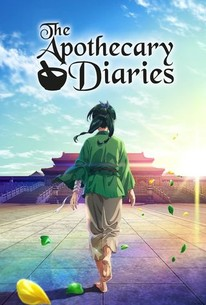
    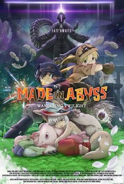
    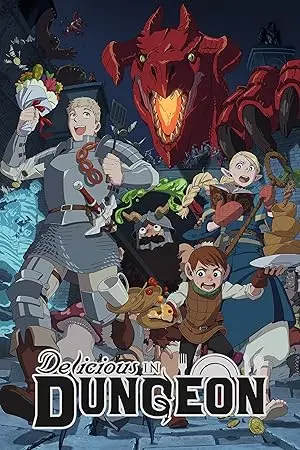
    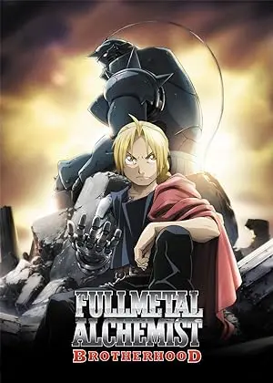
    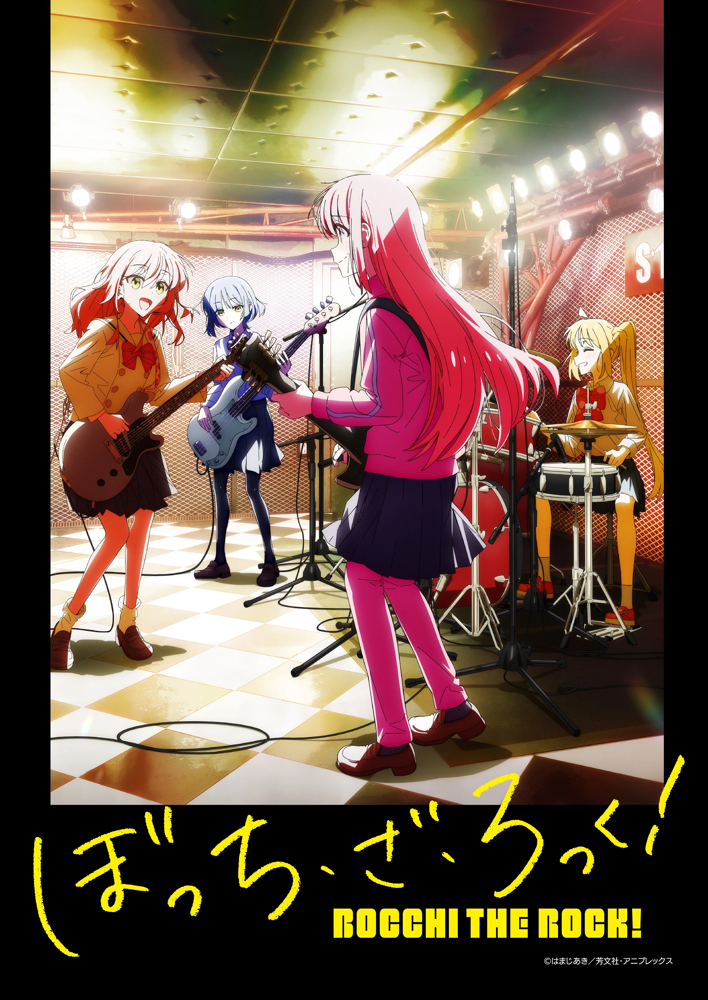
  

   

    
    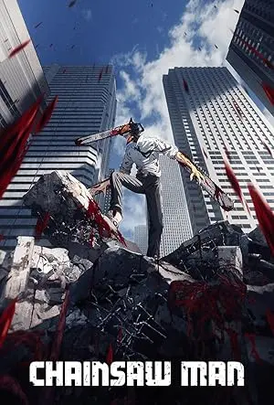
    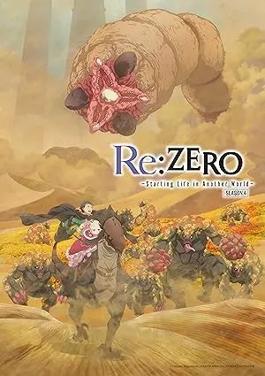
    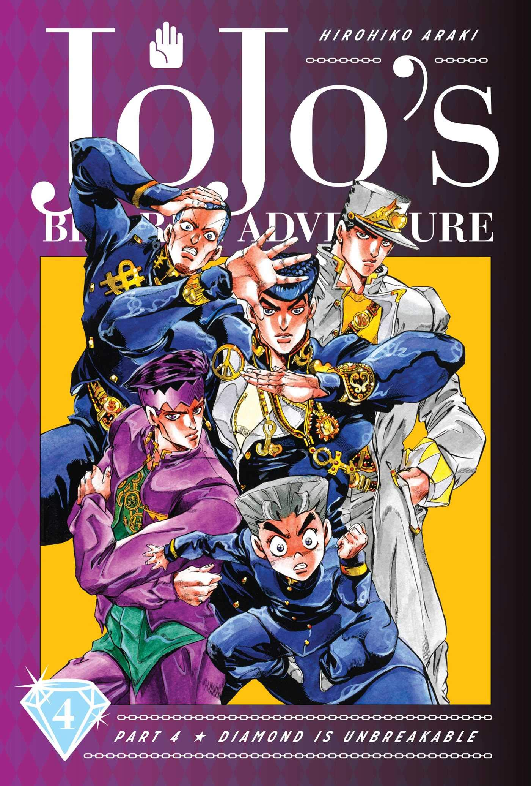
    
  

